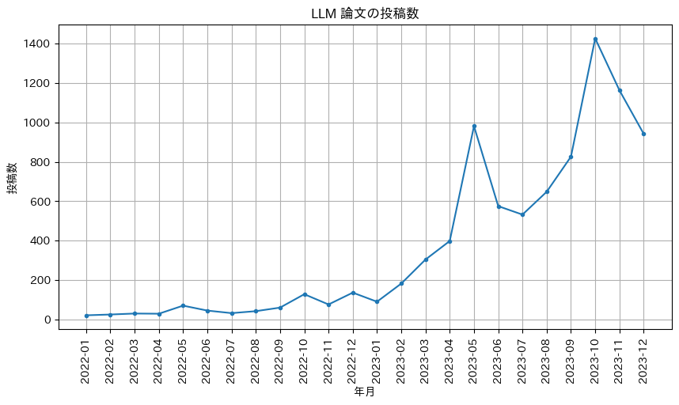
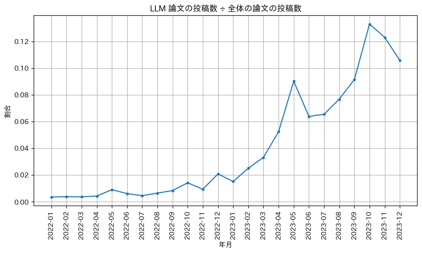
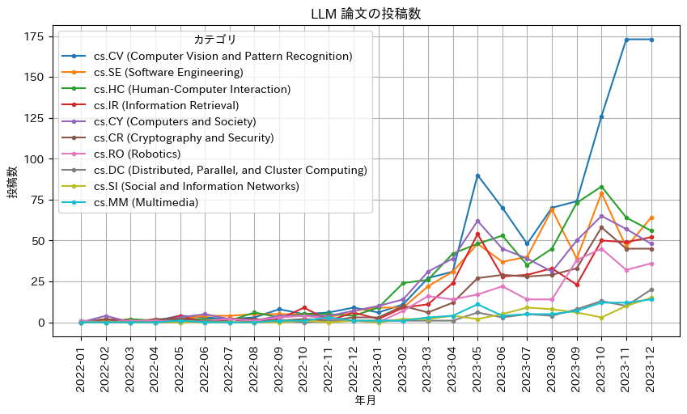
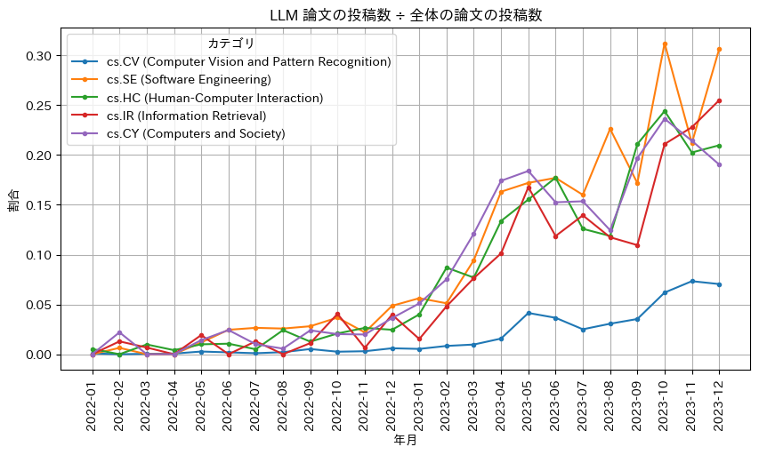
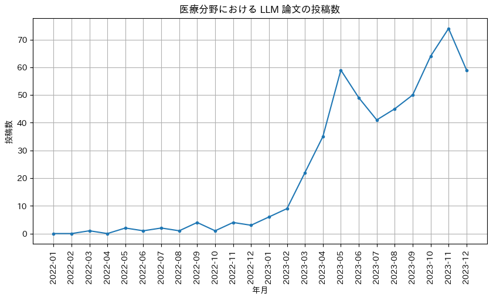
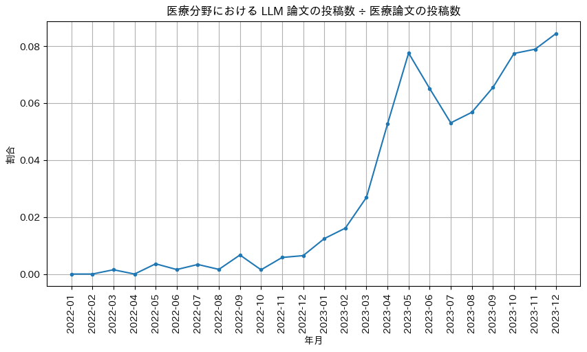
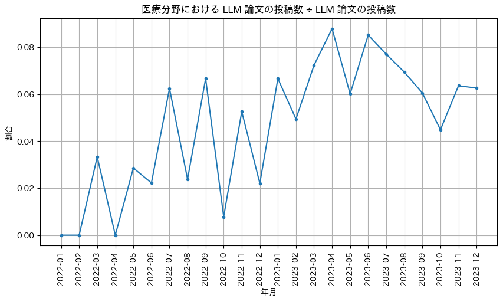
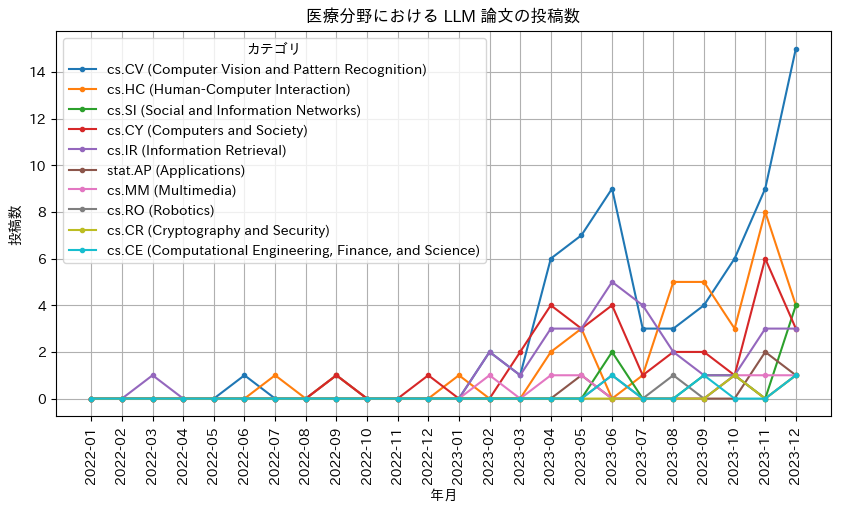

# はじめに
2022年11月に ChatGPT が公開されてから早くも1年以上が経過しました。
この1年で、技術者・非技術者問わず多くの人が ChatGPT を利用し始め、各社が競って大規模言語モデル（以下「LLM」）を発表し、オープンソースの LLM 開発が進み、クラウドサービスで LLM が容易にアプリケーションに組み込めるようになりました。

弊社でも LLM を用いて自社プロダクトの提供価値を高めるべく、社内で議論や PoC を進めています。

そんな中で「実際 LLM はどのくらい流行っているのだろう」「その中でも医療分野においてはどうだろう」という疑問が出てきたので、LLM に関わるトレンドを分析したいと思います。

# 分析方法
今回は「arXiv に投稿された論文の件数」を軸にトレンドを見ていきます。

arXiv に投稿された論文全体から、まず期間とカテゴリを絞ったのち、LLM に関連する論文（以下「LLM 論文」）と医療に関連する論文（以下「医療論文」）を判別して、その件数や割合を可視化します。

[Movva et al. (2023)](https://arxiv.org/abs/2307.10700) で用いられている手法を参考に、以下の通り行いました。

- 期間は2022年1月から2023年12月までの丸2年間（2021年以前は LLM 論文がほぼなかったため）
- [arXiv カテゴリ](https://arxiv.org/category_taxonomy)が cs もしくは stat のもののみを使用
- 特定のキーワード（LLM, Large Language Model, GPT-3, GPT-4, ChatGPT, PaLM, Bard, LLaMA, Claude）が含まれるかどうかで LLM 論文を判別
- PaLM 2 を用いて医療論文を判別（網羅的なキーワードを見つけることが難しく、また PaLM 2 で精度高く分類が可能だと確認できたため）

最後の項目については、目視で抽出した医療論文・非医療論文のそれぞれ200件、合計400件を PaLM 2 で判別した結果、F1スコアが0.9975となりました。

実際に行った内容は[こちらの GitHub レポジトリ](https://github.com/yuichi0625/blog-llm-trend-analysis)をご覧ください。

# 分析結果
## LLM 論文のトレンド
まず、LLM 論文のトレンドを見ていきます。

次のグラフは LLM 論文の投稿数を年月ごとに描画したものです。
流行っているという感覚の通り、2023年に入って投稿数が鰻登りになっているのが確認できます。

また、上の数字を全体の投稿数で割った「全体における LLM 論文の割合」を見てみると、こちらも急上昇しており、2023年10月あたりからは10%を超えるほどになっています。

カテゴリごとの傾向を見るため、投稿数上位10カテゴリを描画したものが次のグラフです。
画像認識カテゴリがずば抜けて増えていて、マルチモーダルの研究が盛んなことが分かります。
それに続いて、エンジニアリング全般、人とコンピューターの相互作用、情報抽出、社会への影響や倫理問題、というように LLM への期待と不安がそのまま反映されたような順位となりました。

上記に関連して、カテゴリ上位5件の割合も確認します。
画像認識以外のカテゴリでは、LLM 論文が20%から30%を占めるようになっていました。
画像認識カテゴリは全体の投稿数が多いので割合は下がりますが、それでも LLM 論文が7%ありました。

## 医療分野における LLM 論文のトレンド
次に、医療分野に限定した LLM 論文のトレンドを見ていきます。
区別しやすいように、今まで見てきた LLM 論文のトレンドを「全分野における LLM 論文のトレンド」と呼ぶようにします。

次のグラフは医療分野における LLM 論文の投稿数を描画したものです。
全分野における LLM 論文のトレンドと同様に、右肩上がりに増えていることが見て取れます。

また、上の数字を医療論文の投稿数で割った「医療分野における LLM 論文の割合」を見てみると、これも順調に推移しており、医療分野でも LLM に対する期待が大きいことが読み取れます。

一方、同じ数字を全分野における LLM 論文の投稿数で割った「LLM 論文における医療分野の割合」を見てみると、2023年6月を期に低下傾向にあることが分かりました。
上で見た通り医療分野においても LLM への期待値は高い反面、他分野に比べて緩やかな成長となっており、厳しい規制など医療ならではの課題が影響していると考えられます。

カテゴリごとの傾向に関しては、全分野における LLM 論文の場合とほぼ同じでした。

# 終わりに
分析をした結果、最初の予想以上に LLM はトレンディーな技術となっていました。
ここ数ヶ月は arXiv の cs , stat カテゴリ投稿論文の10%以上を占めており、マルチモーダルの研究も増加傾向にありました。
もちろん期待が大きい分、社会への影響や倫理問題などに関しても研究が進められていました。

また、医療界隈も LLM に大きな期待を抱いていることが分かりました。
ただ全体のトレンドに比べて、医療分野では成長が緩やかになっている様子も確認できました。
やはり色々な規制や制限がある中で、しっかりと腰を据えて取り組んでいかなければならないのだと再認識させられました。

私たち MICIN データソリューション部は引き続き、LLM の性能限界を踏まえた適切な応用、および最新技術の臨床現場への活用についてさらなる研究や開発を進めていきます。

# 参考文献
- Movva, Rajiv., Balachandar, Sidhika., Peng, Kenny., Agostini, Gabriel., Garg, Nikhil., and Pierson, Emma. (2023). Topics, Authors, and Networks in Large Language Model Research: Trends from a Survey of 17K arXiv Papers. https://arxiv.org/abs/2307.10700
